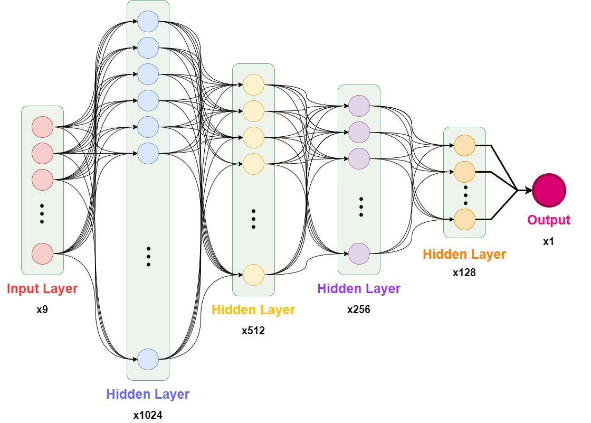
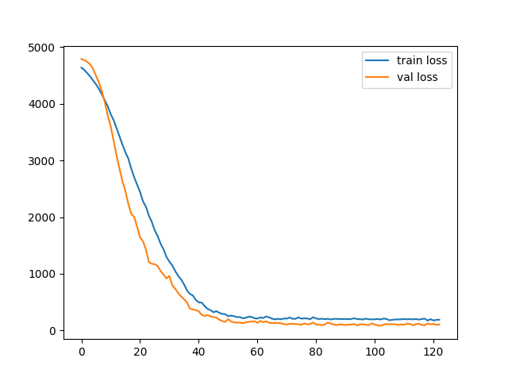

# DPNN

Wastewater treatment, particularly for industrial wastewater, remains a critical area of research due to the growing scarcity of water resources and the significant volume of wastewater generated globally. Among various treatment techniques, photocatalytic materials such as titanium dioxide (TiO2) have gained popularity for their cost-effectiveness and efficiency. Enhancing TiO2 by doping it with metallic and non-metallic elements has further expanded its light absorption spectrum from ultraviolet to visible light, improving its capacity to utilize natural sunlight effectively.

Despite these advancements, experimental approaches to evaluate and optimize photocatalytic degradation processes are often expensive and labor-intensive. To overcome these challenges, we developed the Degradation Predictor Neural Network (DPNN), a multi-layer perceptron artificial neural network model designed to predict the degradation rate of industrial wastewater pollutants with high accuracy.

The DPNN model utilizes nine key input parameters for training and has demonstrated exceptional predictive performance, achieving a coefficient of determination (R²) of 0.943. Comparative analysis against alternative models—including linear regression, random forest, XGBoost, and LightGBM—further highlights DPNN's superior precision and reliability, making it a valuable tool for advancing wastewater treatment research and applications.

the model training method, with the y-axis representing network loss and the x-axis indicating training repetitions over time.

